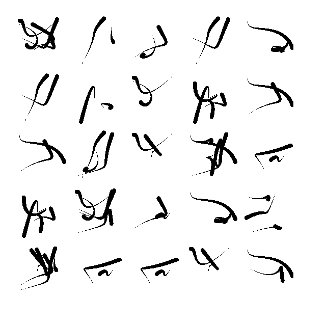

.. procedural-script documentation master file, created by
   sphinx-quickstart on Wed Feb 22 23:16:53 2017.
   You can adapt this file completely to your liking, but it should at least
   contain the root `toctree` directive.

Procedurally Generated Script
=============================

.. toctree::
   :maxdepth: 2
   :caption: Contents:
   Introduction

This project aims to procedurally generate curves such that they resemble handwriting. Here is an example:

This project was originally a computer graphics (CSCI 580) project done by `Sam Pollard (me) <http://ix.cs.uoregon.edu/~spollard>`_ at Western Washington University under the instruction of `Geof Matthews <http://github.com/geofmatthews/>`_. The source code is hosted on `GitHub <http://github.com/sampollard/procedural-script/>`_ and right now consists of a few Python files which when executed run a pygame instance, drawing the image realtime, and saving the image to a file.

This has been inactive since I have been working on other things but please contact me if you would like to contribute. I can be reached at spollard at cs dot uoregon dot edu.

Some ideas I have for continuing this are

- Beautifying the existing output. One thought would be to compress each character dynamically depending on its width; essentially the program would automatically adjust the kerning.
- Increasing the rendering speed. Currently, this samples each pixel and determines whether that pixel is inside or outside of the bézier curve. This is what Python is incredibly ill-suited for. A "stretch" goal would be to render this on a GPU (one implementation is described in `GPU Gems <http://http.developer.nvidia.com/GPUGems3/gpugems3_ch25.html>`_).
- Increasing the number of tunable parameters while keeping the user interface simple. Examples include changing the direction of the text, another could be adjusting the "sharpness" of the curves.
- Developing an actual API. That way, someone could import the module then call something like ``handwriting = bezier.Handwriting(...)`` then call ``handwriting.render()``

.. Indices and tables
.. ==================

.. * :ref:`genindex`
.. * :ref:`modindex`
.. * :ref:`search`

